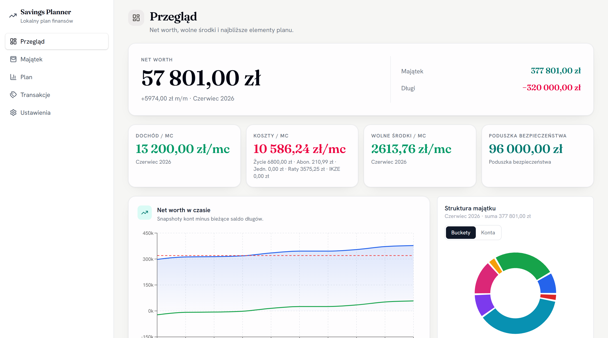
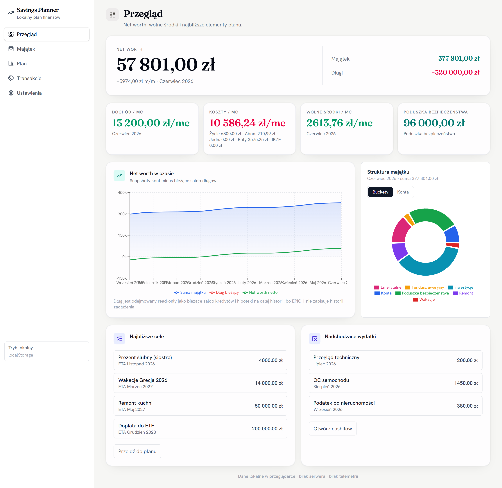
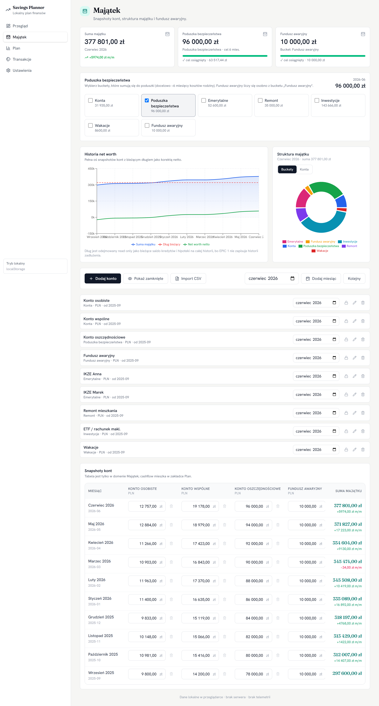
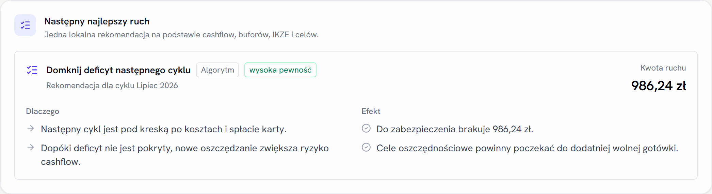
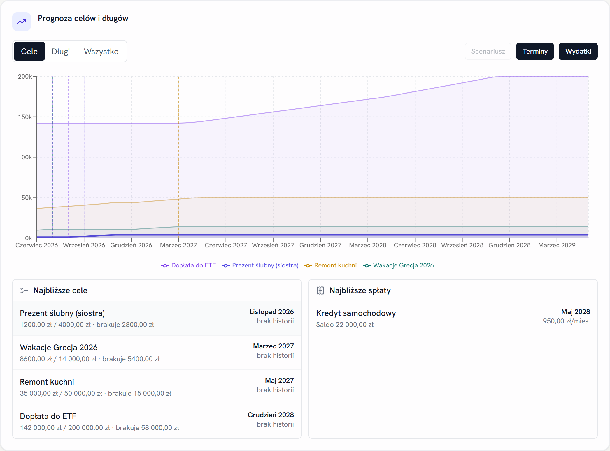
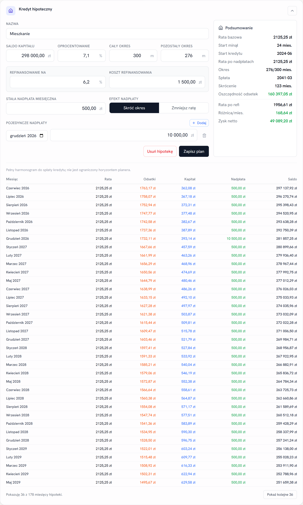
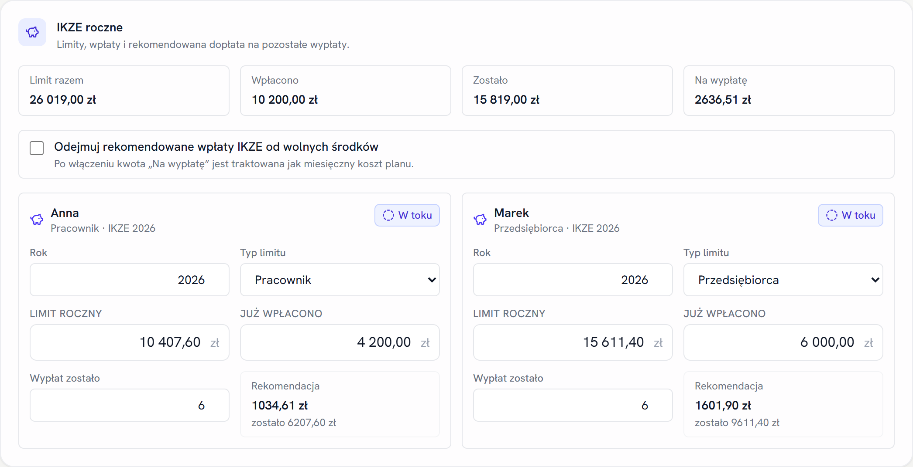

# Savings Planner

A self-hosted personal finance planner for households: track net worth across accounts, plan savings goals and debt payoff, model a mortgage, and get a single deterministic "what should I do with this month's money" recommendation — no cloud, no telemetry, your data stays on your machine.

Runs fully **client-side** by default (data in your browser). An optional **Kotlin/Spring Boot backend** adds a real database, bank-statement import, and pay-period budgeting.



> Screenshots use a fully synthetic dataset — no real financial data. You can load the exact same demo: see [Try it with demo data](#try-it-with-demo-data).

---

## What it does

The app is organized into five workspaces:

### 📊 Przegląd (Overview)
Net worth at a glance — total assets minus debts — with a month-over-month trend, an assets-by-bucket donut, monthly cashflow stat cards, and the next goals / upcoming expenses.



### 💰 Majątek (Assets)
Account snapshots over time across seven buckets (cash, safety cushion, retirement, renovation, investments, vacation, emergency fund). Net-worth history chart, asset structure, a configurable safety-cushion target (~6 months of family costs) and a separate fast-access emergency fund. Accounts have a lifecycle (opened/closed) so historical net worth stays accurate.



### 🧭 Plan
The planning core:

- **Monthly cashflow** — base income, living costs, subscriptions, one-off expenses, loan/mortgage payments and IKZE contributions rolled into free cash.
- **Next best action** — one deterministic recommendation (no LLM) ranking: cover next cycle's deficit → rebuild safety buffers → IKZE → top active goal → park the surplus.

  

- **Security-buffer focus** — system goals that rebuild the safety cushion and emergency fund first.
- **Goal & debt forecast** — projected completion per goal/loan with deadline on-time/missed badges and a what-if simulation.

  

- **Mortgage planner** — fixed-rate amortization with monthly + one-time overpayments (shorten term or reduce payment), a refinancing scenario with net-savings, and a full payoff schedule.

  

- **Annual IKZE planner** (PL tax-advantaged retirement) — per-person limits, contributions and recommended top-up.

  

- Plus a credit-card tracker, subscriptions, upcoming one-off expenses and an editable monthly schedule.

### 🏷️ Transakcje (Transactions) · backend mode
Pay-period budgeting (paycheck-to-paycheck cycles), category rules, leak analysis (recurring charges, micro-expenses, cycle-over-cycle increases) and CSV/PDF bank-statement import. These run against the Spring Boot backend.

### ⚙️ Ustawienia (Settings)
Plan horizon, JSON import/export, and backend status.

---

## Try it with demo data

The repo ships a synthetic dataset at [`docs/demo-data.json`](docs/demo-data.json) (no real numbers). To explore a populated app:

1. `npm run dev` and open the app.
2. Go to **Ustawienia → Import**, paste/upload `docs/demo-data.json`.
3. Browse Przegląd / Majątek / Plan with everything filled in.

Regenerate the dataset any time with `node scripts/make-demo-data.mjs`.

---

## Tech stack

| Layer | Tech |
|---|---|
| Build | Vite 8 |
| UI | React 19 + TypeScript |
| Styling | Tailwind CSS 4 |
| State | Zustand 5 (persisted to localStorage) |
| Charts | Recharts 3 |
| Drag & drop | @dnd-kit |
| Icons | lucide-react |
| Frontend tests | Vitest |
| Backend (optional) | Kotlin 2.1 · Spring Boot 3.5 · JPA · PostgreSQL · Flyway |

---

## Quick start

```bash
git clone https://github.com/Jakub-Mikolajczyk-pl/savings-planner.git
cd savings-planner
npm install
npm run dev
```

Open [http://localhost:5173](http://localhost:5173). The app runs in **local mode** — data lives in your browser, nothing is sent anywhere.

```bash
npm test          # unit tests (Vitest)
npm run build     # production build -> dist/
npm run lint      # eslint
```

---

## Backend mode

Local mode (the default) needs no server. To use the Spring Boot backend in `backend/` as the source of truth, create `.env.local`:

```bash
VITE_BACKEND=api
VITE_API_BASE_URL=http://localhost:8080
VITE_API_TOKEN=dev-token
```

In API mode the frontend sends `X-Api-Token` on every `/api/**` request and hydrates Zustand from the backend on startup; Zustand then acts as a UI cache. Use `VITE_BACKEND=local` (or omit it) for the browser-only experience.

The backend is a standard Spring Boot app:

```bash
cd backend
./gradlew bootRun        # needs a PostgreSQL pointed at by application config
./gradlew test           # Testcontainers-backed repository tests
```

---

## Self-hosted deploy

The app is built to deploy as two Docker containers behind nginx, driven by CI — but nothing is tied to a specific provider, so the same setup works on any Docker host or registry:

- **CI** runs frontend lint/test/build and backend test/build, then builds and pushes two images (frontend, backend) to a container registry and deploys them to the host.
- **`docker-compose.prod.yml`** runs `frontend` (nginx on port 80) and a private `backend` on the compose network.
- **`nginx.conf.template`** serves the SPA and proxies `/api/**` to `backend:8080`, injecting `X-Api-Token` from the container env — so the API token is **not** baked into the browser bundle.

Configuration is environment-driven; copy [`.env.example`](.env.example) to the host's `.env` and set the registry, image tag, and API token. Rolling back is `docker compose pull && up -d` with a previous image tag.

> The frontend bundle is public by design; treat `VITE_API_TOKEN` as a LAN/dev convenience token, not a backend-grade secret. Keep the backend off the public internet or behind real auth.

---

## How it works

The planning engine (`src/domain/allocation.ts`) runs in the browser and recomputes a monthly schedule reactively on every state change:

1. **Loan & mortgage payments** are deducted first (minimum + overpayment).
2. **Free cash** (income − living costs − subscriptions − one-off − debt − optional IKZE) is distributed to goals: fixed monthly allocations first, then the rest by urgency (deadline proximity × amount remaining).
3. **Security buffers** (safety cushion, emergency fund) are treated as priority-1 virtual goals computed from account snapshots.
4. **Next best action** (`src/domain/nextBestAction.ts`) ranks the single most useful move deterministically — an optional local LLM may only *narrate* the explanation, never decide.
5. **GoalProgress** records each goal's completion vs. its deadline: on time, missed, or no deadline.

In local mode data never leaves the device. In API mode the backend is the source of truth.

---

## Project structure

```
src/
  domain/          # pure logic: allocation, mortgage, next-best-action, formatting, types
  store/           # Zustand store (local + API modes, persistence)
  api/             # typed backend client
  components/
    accounts/        # snapshots, net-worth chart, assets pie
    plan/            # next-best-action, security buffers
    mortgage/        # mortgage planner + schedule
    ikze/            # annual IKZE planner
    goals/ loans/    # goal & debt CRUD
    chart/           # forecast chart + what-if slider
    creditcard/ subscriptions/ expenses/
    transactions/ payperiods/ categorization/ leakanalysis/ ingest/  # backend-mode
    ui/              # shared layout & inputs
backend/           # Kotlin + Spring Boot API (optional)
scripts/           # make-demo-data.mjs (demo dataset)
docs/              # demo-data.json, screenshots
```

---

## Versioning

This project follows [Semantic Versioning](https://semver.org/) (`MAJOR.MINOR.PATCH`):

- **MAJOR** — breaking changes to the data model, JSON import/export format, or backend API.
- **MINOR** — new features, backward-compatible.
- **PATCH** — bug fixes and internal changes.

The version in [`package.json`](package.json) is the source of truth and is mirrored in the backend build. Every release is recorded in [`CHANGELOG.md`](CHANGELOG.md) and tagged `vMAJOR.MINOR.PATCH` on both mirrors (GitHub and the self-hosted Forgejo). The two mirrors keep independent commit hashes by design; the tag name and tree content are what match.

To cut a release: bump `package.json` (and `backend/build.gradle.kts`), add a `CHANGELOG.md` entry, commit, then `git tag vX.Y.Z` and push the tag to both remotes.

---

## License

MIT
